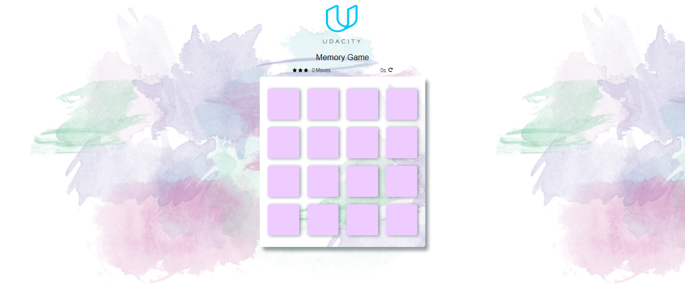

# Memory Game

It is a simple memory game designed using HTML, CSS, JS wihe sublime text editor | Ejoy :")
### What it include

  -  Counter 
  - Star rating
  - Restart button
  - Number of transfers
  - Pop-up window "Congratulations"

### How to play!

  - Depend on memory
  - There are two similar images within the boxes arranged randomly
  - To win this game you must remember the places of the two pictures in the least time and the number of movements possible
  
### download the source

you will find the source files above:
You can obtain them by cloning the repository or downloading as a compressed file.

  #### screenshot

